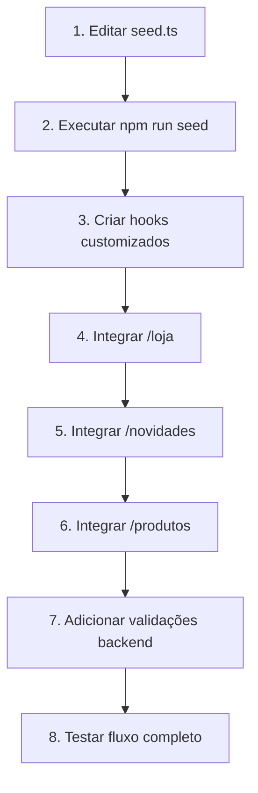

# 🎯 Plano de Integração: Produtos Dinâmicos (Backend → Frontend)

**Data:** 08/11/2025  
**Objetivo:** Substituir produtos mockados por dados dinâmicos do banco de dados PostgreSQL

---

## 📋 Contexto Atual

### Situação Atual
- ✅ Backend com API de produtos funcionando
- ✅ Estrutura Prisma com campos `isFeatured` e `isActive`
- ❌ Frontend usando dados mockados de `@/data/products.ts`
- ❌ Produtos mockados (4 produtos) não estão no banco de dados

### Produtos Mockados Atuais
```typescript
1. Oversized Tee Geometric - R$ 189,90 (featured: true, new: true)
2. Calça Cargo Urban - R$ 299,90 (featured: true, new: false)
3. Moletom Medina - R$ 349,90 (featured: false, new: true)
4. Crop Top Arabesque - R$ 159,90 (featured: true, new: true)
```

---

## 🎯 Regras de Negócio

### 1. **Campo `isActive`**
- `true` → Produto aparece na **Loja** (/loja) e em **Produtos** (/produtos)
- `false` → Produto aparece **APENAS no Painel Admin**

### 2. **Campo `isFeatured`**
- `true` → Produto aparece em **Novidades** (/novidades)
- `true` → Produto **DEVE** também ter `isActive = true` (validação obrigatória)

### 3. **Validação Crítica**
> ⚠️ **IMPORTANTE:** Não pode existir produto com `isFeatured=true` e `isActive=false`

---

## 📝 Plano de Ação Detalhado

### **FASE 1: Popular Banco de Dados**

#### ✅ **Tarefa 1.1:** Adicionar produtos mockados ao `seed.ts`

**Arquivo:** `backend/prisma/seed.ts`

**Ações:**
1. Adicionar os 4 produtos mockados como produtos no seed
2. Mapear campos corretamente:
   - `featured` (mock) → `isFeatured` (banco)
   - Adicionar `isActive: true` para todos
   - `new` (mock) → não existe no banco (remover)
3. Adicionar imagens reais do Cloudinary
4. Criar variantes (tamanhos/cores) para cada produto
5. Adicionar dimensões para cálculo de frete
6. Adicionar especificações detalhadas

**Mapeamento de Produtos:**

```typescript
// Produto 1: Oversized Tee Geometric
{
  name: 'Oversized Tee Geometric',
  slug: 'oversized-tee-geometric',
  price: 189.90,
  category: 'camiseta',
  gender: 'MALE',
  isFeatured: true,  // ✓ Aparece em Novidades
  isActive: true,    // ✓ Aparece na Loja
  collection: 'Desert Dreams',
  sizes: ['P', 'M', 'G', 'GG'],
  colors: ['Preto', 'Bege', 'Branco'],
  images: [IMAGES.roupa1Frente, IMAGES.roupa1Tras]
}

// Produto 2: Calça Cargo Urban
{
  name: 'Calça Cargo Urban',
  slug: 'calca-cargo-urban',
  price: 299.90,
  category: 'calca',
  gender: 'MALE',
  isFeatured: true,  // ✓ Aparece em Novidades
  isActive: true,    // ✓ Aparece na Loja
  collection: 'Urban Nomad',
  sizes: ['38', '40', '42', '44'],
  colors: ['Preto', 'Verde Oliva', 'Bege'],
  images: [IMAGES.roupa2Frente, IMAGES.roupa2Tras]
}

// Produto 3: Moletom Medina
{
  name: 'Moletom Medina',
  slug: 'moletom-medina',
  price: 349.90,
  category: 'moletom',
  gender: 'MALE',
  isFeatured: false, // ✗ NÃO aparece em Novidades
  isActive: true,    // ✓ Aparece na Loja
  collection: 'Desert Dreams',
  sizes: ['P', 'M', 'G', 'GG'],
  colors: ['Preto', 'Cinza', 'Bege'],
  images: [IMAGES.roupa3Frente, IMAGES.roupa3Tras]
}

// Produto 4: Crop Top Arabesque
{
  name: 'Crop Top Arabesque',
  slug: 'crop-top-arabesque',
  price: 159.90,
  category: 'crop-top',
  gender: 'FEMALE',
  isFeatured: true,  // ✓ Aparece em Novidades
  isActive: true,    // ✓ Aparece na Loja
  collection: 'Sahara Soul',
  sizes: ['PP', 'P', 'M', 'G'],
  colors: ['Preto', 'Branco', 'Dourado'],
  images: [IMAGES.roupa4Frente, IMAGES.roupa4Tras]
}
```

#### ✅ **Tarefa 1.2:** Executar seed no banco

```bash
cd backend
npm run seed
```

---

### **FASE 2: Criar Hooks Customizados**

#### ✅ **Tarefa 2.1:** Criar `useProducts` para Loja

**Arquivo:** `frontend/src/hooks/useProducts.ts` (novo)

```typescript
import { useState, useEffect } from 'react';
import { productService, Product } from '@/services/product.service';

export function useProducts(filters?: { category?: string; isActive?: boolean }) {
  const [products, setProducts] = useState<Product[]>([]);
  const [isLoading, setIsLoading] = useState(true);
  const [error, setError] = useState<string | null>(null);

  useEffect(() => {
    async function fetchProducts() {
      try {
        setIsLoading(true);
        const result = await productService.getProducts({
          ...filters,
          isActive: filters?.isActive ?? true, // Default: apenas ativos
        });
        setProducts(result.data);
      } catch (err) {
        setError('Erro ao carregar produtos');
        console.error(err);
      } finally {
        setIsLoading(false);
      }
    }

    fetchProducts();
  }, [filters]);

  return { products, isLoading, error };
}
```

#### ✅ **Tarefa 2.2:** Criar `useFeaturedProducts` para Novidades

**Arquivo:** `frontend/src/hooks/useFeaturedProducts.ts` (novo)

```typescript
import { useState, useEffect } from 'react';
import { productService, Product } from '@/services/product.service';

export function useFeaturedProducts() {
  const [products, setProducts] = useState<Product[]>([]);
  const [isLoading, setIsLoading] = useState(true);
  const [error, setError] = useState<string | null>(null);

  useEffect(() => {
    async function fetchFeaturedProducts() {
      try {
        setIsLoading(true);
        const data = await productService.getFeaturedProducts();
        setProducts(data);
      } catch (err) {
        setError('Erro ao carregar novidades');
        console.error(err);
      } finally {
        setIsLoading(false);
      }
    }

    fetchFeaturedProducts();
  }, []);

  return { products, isLoading, error };
}
```

---

### **FASE 3: Integrar Frontend com Backend**

#### ✅ **Tarefa 3.1:** Integrar página Loja (/loja)

**Arquivo:** `frontend/src/app/loja/page.tsx`

**Alterações:**
```typescript
// ANTES:
import { products } from '@/data/products';

// DEPOIS:
import { useProducts } from '@/hooks/useProducts';

function LojaContent() {
  // ANTES:
  // let produtosFiltrados = products;

  // DEPOIS:
  const { products, isLoading, error } = useProducts({ isActive: true });
  
  if (isLoading) return <LoadingSpinner />;
  if (error) return <ErrorMessage message={error} />;
  
  let produtosFiltrados = products;
  // ... resto do código
}
```

#### ✅ **Tarefa 3.2:** Integrar página Novidades (/novidades)

**Arquivo:** `frontend/src/app/novidades/page.tsx`

**Alterações:**
```typescript
// ANTES:
import { products } from '@/data/products';

// DEPOIS:
import { useFeaturedProducts } from '@/hooks/useFeaturedProducts';

function NovidadesContent() {
  // ANTES:
  // const produtosFiltrados = products.filter(p => p.featured);

  // DEPOIS:
  const { products, isLoading, error } = useFeaturedProducts();
  
  if (isLoading) return <LoadingSpinner />;
  if (error) return <ErrorMessage message={error} />;
  
  // products já vem filtrado com isFeatured=true do backend
}
```

#### ✅ **Tarefa 3.3:** Integrar página Produtos (/produtos)

**Arquivo:** `frontend/src/app/produtos/page.tsx`

**Alterações:**
```typescript
// ANTES:
import { products } from '@/data/products';

// DEPOIS:
import { useProducts } from '@/hooks/useProducts';

export default function ProdutosPage() {
  const { products, isLoading, error } = useProducts({ isActive: true });
  
  // Manter lógica de filtros e ordenação local
}
```

---

### **FASE 4: Validação e Testes**

#### ✅ **Tarefa 4.1:** Adicionar validação no backend

**Arquivo:** `backend/src/services/product.service.ts`

**Adicionar validação:**
```typescript
async createProduct(data: CreateProductDTO) {
  // Validação: se isFeatured=true, então isActive DEVE ser true
  if (data.isFeatured && !data.isActive) {
    throw new BadRequestError('Produtos em destaque devem estar ativos');
  }
  
  // ... resto do código
}

async updateProduct(id: string, data: UpdateProductDTO) {
  // Validação: se isFeatured=true, então isActive DEVE ser true
  if (data.isFeatured && data.isActive === false) {
    throw new BadRequestError('Produtos em destaque devem estar ativos');
  }
  
  // ... resto do código
}
```

#### ✅ **Tarefa 4.2:** Testes de integração

**Checklist de testes:**
- [ ] Página `/loja` mostra produtos com `isActive=true`
- [ ] Página `/novidades` mostra produtos com `isFeatured=true`
- [ ] Página `/produtos` mostra produtos com `isActive=true`
- [ ] Painel Admin mostra TODOS os produtos (incluindo `isActive=false`)
- [ ] Não é possível criar produto com `isFeatured=true` e `isActive=false`
- [ ] Filtros por categoria funcionam corretamente
- [ ] Loading states aparecem durante carregamento
- [ ] Error states aparecem em caso de falha

---

## 🔄 Mapeamento de Campos

### Frontend Mock → Backend Database

| Campo Mock | Campo Backend | Tipo | Observação |
|------------|---------------|------|------------|
| `id` | `id` | string (UUID) | Gerado automaticamente |
| `name` | `name` | string | - |
| `slug` | `slug` | string | Único |
| `description` | `details.description` | string | Relacionamento 1:1 |
| `price` | `price` | Decimal | - |
| `category` | `category` | string | 'masculino' → 'camiseta', 'calca', etc |
| `collection` | `collection.name` | string | Relacionamento N:1 |
| `sizes` | `variants.size` | string[] | Relacionamento 1:N |
| `colors` | `variants.color` | string[] | Relacionamento 1:N |
| `images` | `images.url` | string[] | Relacionamento 1:N |
| `featured` | `isFeatured` | boolean | **RENOMEADO** |
| `new` | - | - | **REMOVIDO** (não existe no backend) |
| - | `isActive` | boolean | **NOVO** (controla visibilidade) |
| - | `stock` | number | **NOVO** (controle de estoque) |
| - | `dimensions` | object | **NOVO** (peso, altura, largura, comprimento) |

---

## 🎨 Componentes Afetados

### Páginas
- ✅ `/loja` (Loja/Vitrine)
- ✅ `/novidades` (Produtos em destaque)
- ✅ `/produtos` (Catálogo completo)
- ✅ `/produto/[slug]` (Detalhes do produto)
- ⚠️ `/admin/produtos` (já integrado com backend)

### Componentes
- ✅ `ProductCard` (já está preparado)
- ✅ `Header` (links funcionam)
- ✅ `Footer` (não afetado)

---

## 🚀 Ordem de Execução



---

## ⚠️ Pontos de Atenção

### 1. **Imagens do Cloudinary**
- Garantir que URLs das imagens estão corretas no seed
- Usar URLs de `IMAGES.roupa1Frente`, `IMAGES.roupa1Tras`, etc

### 2. **Variantes de Produtos**
- Criar variantes para CADA combinação tamanho + cor
- Definir estoque para cada variante

### 3. **Dimensões para Frete**
- Adicionar peso, altura, largura e comprimento
- Necessário para cálculo de frete via Correios

### 4. **Coleções**
- Verificar se coleções já existem no seed antes de associar

### 5. **Backward Compatibility**
- Manter fallback para mock em caso de erro da API
- Não remover `@/data/products.ts` até integração completa

---

## 📊 Resultado Esperado

### Antes (Mock)
```
Frontend → @/data/products.ts (dados estáticos)
```

### Depois (Dinâmico)
```
Frontend → Hook → productService → API Backend → PostgreSQL
```

### Fluxo de Dados
1. **Loja** (`/loja`) → `useProducts({ isActive: true })`
2. **Novidades** (`/novidades`) → `useFeaturedProducts()` → filtra `isFeatured=true`
3. **Produtos** (`/produtos`) → `useProducts({ isActive: true })`
4. **Admin** (`/admin/produtos`) → `useAdminProducts()` → mostra TODOS

---

## 📝 Checklist Final

### Backend
- [ ] Seed atualizado com 4 produtos mockados
- [ ] Produtos com `isFeatured` e `isActive` corretos
- [ ] Variantes criadas (tamanhos + cores)
- [ ] Dimensões adicionadas
- [ ] Imagens do Cloudinary configuradas
- [ ] Validação `isFeatured` → `isActive` implementada
- [ ] Seed executado com sucesso

### Frontend
- [ ] Hook `useProducts` criado
- [ ] Hook `useFeaturedProducts` criado
- [ ] Página `/loja` integrada
- [ ] Página `/novidades` integrada
- [ ] Página `/produtos` integrada
- [ ] Loading states implementados
- [ ] Error handling implementado
- [ ] Fallback para mock em caso de erro (opcional)

### Testes
- [ ] Loja mostra produtos ativos
- [ ] Novidades mostra produtos featured
- [ ] Admin mostra todos produtos
- [ ] Filtros funcionando
- [ ] Performance adequada
- [ ] UX responsiva

---

## 🎯 Tempo Estimado

| Fase | Tempo Estimado |
|------|----------------|
| Fase 1: Popular Banco | 1h30 |
| Fase 2: Criar Hooks | 30min |
| Fase 3: Integrar Frontend | 2h |
| Fase 4: Validação e Testes | 1h |
| **TOTAL** | **5h** |

---

## 📚 Referências

- [Documentação Prisma](https://www.prisma.io/docs)
- [Next.js Data Fetching](https://nextjs.org/docs/app/building-your-application/data-fetching)
- [React Hooks](https://react.dev/reference/react)
- [NSR Product Service](frontend/src/services/product.service.ts)

---

**Status:** 📋 Planejamento Completo  
**Pronto para execução:** ✅ SIM
